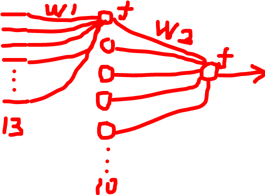

# Improvement of Udacity’s Neural Network for My School’s

## -- An implementation of Udacity’s CarND MiniFlow (Class five) 

The Udacity’s backprop is cleaner than what I have learned in the school. I had a class in school about neural network, and I had another in Udacity. At last, there are only two rules to remember for backprop.

1. Use the local derivative multiplies the thing that is reversely passed by a note.
2. If there are many notes that reversely passes the thing, add them together.

I am very glad that the Udacity agrees with Stanford’s idea ([cs231n](http://cs231n.stanford.edu/)), which means it is really a good idea. The linear, the S function and the input are considered separated nodes. When I was at school, I traded them as one cell, which caused chaos. However, taking a node with many inputs is not a good think, I think. In Stanford’s [cs231n](http://cs231n.stanford.edu/), they seem trade every binary operation as a node which is cleaner.

### My improvements:

1. I translate the means of variable for data set Boston Housing. You can see what the foreigner concerns when buying the house.
2. The last assessment is a network like the following figure. Udacity’s class is not focusing on this. But, the Chinese teacher will concern, I think.

